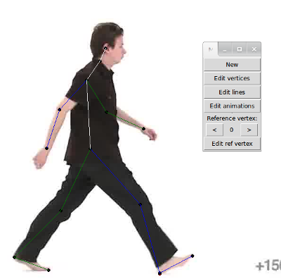

AnimationEditor
===============

Animation editor; simplifies the process of extracting vector animations from videos for machine learning

Notes
-----

To run, execute "python MainMenu.py".

This is a work in progress project. It is being used by the .

