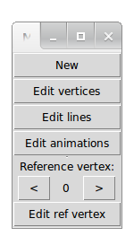
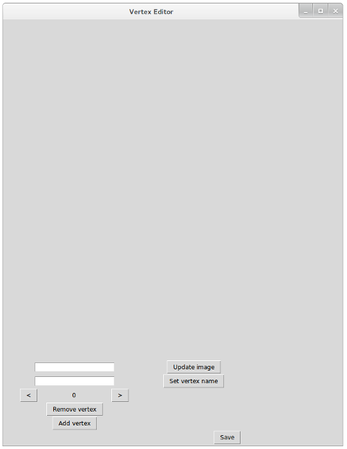
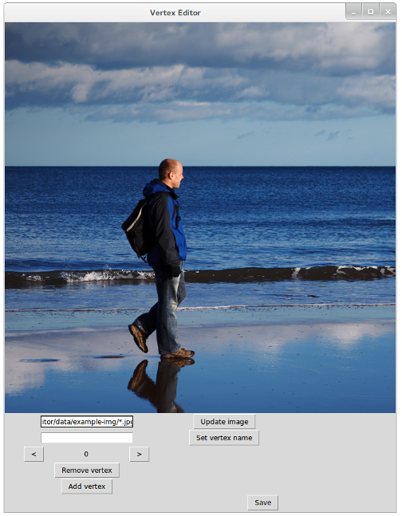
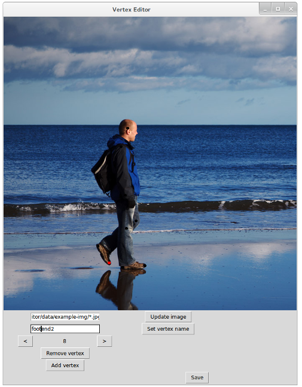
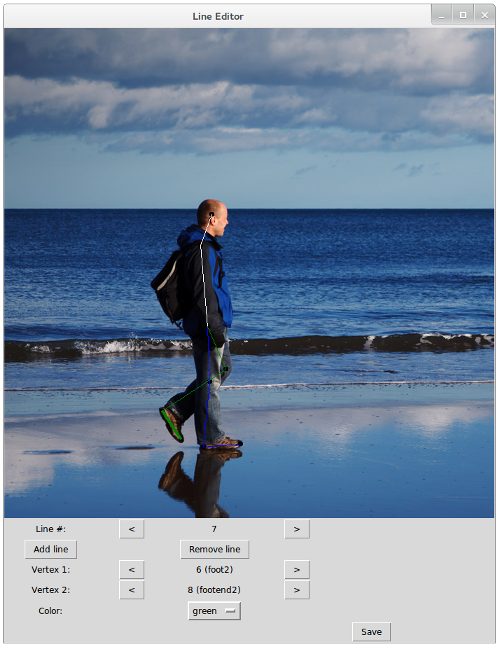
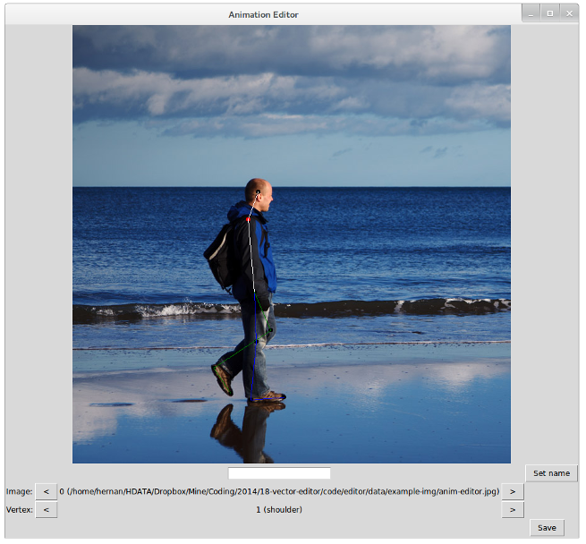

AnimationEditor
===============

Animation editor; simplifies the process of extracting vector animations from videos for machine learning

This project has been used by the [procedural locomotion project](https://github.com/hmoraldo/ProceduralLocomotion). For the procedural locomotion project, we built a dataset of 25 walking animations (each with multiple frames). Then we used machine learning to compute a simple algorithm for generating continous walking animations.

(the background image used for the screenshot is a public domain image from [publicdomainpictures.net](http://www.publicdomainpictures.net/view-image.php?image=11855&picture=walking-on-the-beach))

Running
-------

To run, execute "python MainMenu.py".

This will show a main menu with 5 buttons:

* New: creates a new json file. The program allows you to select what are the frames from the video you want to extract vertex information from, add as many named vertices as needed, and set their default positions.

* Edit vertices: opens a json file created with the New button, and allows the user to change the animation properties (including position and number of vertices).

* Edit lines: opens a json file and allows the user to create lines between vertices, with different colors. Having lines between vertices makes the animation process easier and more intuitive.

* Edit animations: allows the user to go through all the frames of an animation, selecting the vertex positions for each.

* Edit ref vertex: press this button after selecting the right reference vertex number. The reference vertex will be used as the origin for all frames; the edit ref vertex menu lets the user edit the position of the reference vertex in a simpler way than by using the edit vertices menu.

New
---

The new menu creates a new json file.

* After clicking on New you are asked to choose a new file name where the data will be stored.

* You will be shown a window like this:

 * If you don't see the bottom buttons, it might be because the screen resolution is too small. This is something that should be fixed in the program (as a workaround, you can easily modify the window size in the Python files)

 * In the first input field, write the path where the image that you will use as background is stored. This is the image that you will use as reference for extracting the vertices.

 * For animations, use globs like "img/test-image*.jpg". This will allow you to edit vertices for frame sequences.

  * The editor doesn't support video file formats directly. The way to use it with animations is to convert video files to frames first, and then use the glob function. For example on Linux, you can download a video from YouTube and extract its frames with a single command: "youtube-dl https://www.youtube.com/watch\?v\=something -o - | avconv -i - -f image2 -r 10 frame%03d.jpg". Another util that is used for this is ffmpeg.

 * Once the image or images path has been selected in the input box, click on "Update image" to actually select the given path. If the selection is ok, the first selected frame will be shown in the window.

 * Once the background image has been selected, you can add vertices by clicking on "Add vertex". You can also click on "Remove vertex" to remove a given vertex. Use the "<" and ">" buttons to navigate between vertices. The zeroth vertex doesn't need to be added, and can't be removed.

 * You can also set vertices names by writing a name for the currently selected vertex at the second input field, then clicking on "Set vertex name". (If you change a vertex name but don't click on "Set vertex name", it won't be remembered by the system)

 * When a vertex is selected, you can set its default position (the position for the initial frame) by clicking on that position on the screen. Vertices that aren't selected will be shown in black, selected vertices will be shown in red.

 * When the process is finished, click on "Save".

Edit vertices
-------------

This menu is identical to the New menu; use this to edit the default positions and names of vertices, and the image / animation frames.

Edit lines
----------

The "Edit lines" menu is used to create lines between vertices. This helps extract the image vertices.

* Use the "Add line" to add new lines, and "Remove line" to remove existing lines. The zeroth line doesn't need to be added, and it can't be removed either.

* For each line you want to add, follow this process:

 * First click on "Add line" (unless you want to edit the already existing zeroth line)

 * A line connects two vertices. The first vertex is selected by clicking on the "<" and ">" buttons of the "Vertex 1:" row. The second vertex is selected by clicking on the "<" and ">" buttons of the "Vertex 2:" row.

 * Select a line color on the "Color" dropdown menu.

* Click on "Save" to save all changes before quitting.

Edit animations
---------------

The animation editor menu allows you to set vertex positions for different frames of a single animation. The data is stored in json format which allows for easy processing in pretty much any programming language.

* Use the first "<" and ">" buttons to traverse the different frames of a given image.

* Use the "<" and ">" buttons at the right of the "Vertex:" label to select a vertex you want to modify in the currently selected frame.

* Click on "Save" before quitting, to save the changes.

